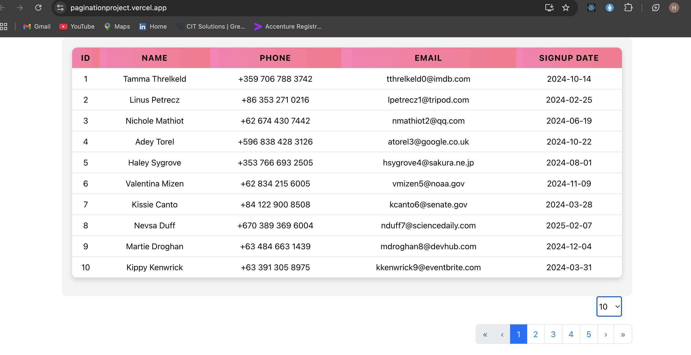

# Pagination Project



This is a simple React-based web application designed to implement and demonstrate pagination for displaying large datasets. The app efficiently fetches and paginates data, allowing users to navigate between pages seamlessly.

## Features
- **Pagination**: Easily navigate through large datasets with next/previous page controls.
- **Data Fetching**: Fetches data from a placeholder API.
- **Responsive Design**:  CSS ensures the app works smoothly on both desktop and mobile devices.

## Technologies Used
- **Frontend**: React.js
- **Styling**:  CSS
- **API**: Placeholder API for fetching data

## Approach
The project focuses on optimizing the user experience with a clean and intuitive UI for pagination. Data is fetched from an external API, and pagination logic is implemented to handle large datasets. The application is designed to be simple, fast, and mobile-responsive.

## How to Run the Project Locally

1. **Clone the repository**:
   ```bash
   git clone https://github.com/yourusername/paginationproject.git
   cd paginationproject
   ```

2. **Install dependencies**:
   Ensure you have Node.js installed, then run:
   ```bash
   npm install
   ```

3. **Run the application**:
   ```bash
   npm start
   ```

   The app will be running on [http://localhost:3000](http://localhost:3000).

## How to Deploy

1. **Deploy to Vercel**:
   - Go to [Vercel](https://vercel.com/).
   - Create a new project and link your GitHub repository.
   - Vercel will automatically handle the deployment for you.

2. **Access the live app**:
   Once deployed, the app will be available on its Vercel URL, such as [https://paginationproject.vercel.app/](https://paginationproject.vercel.app/).


